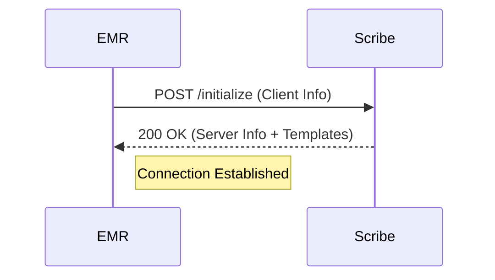
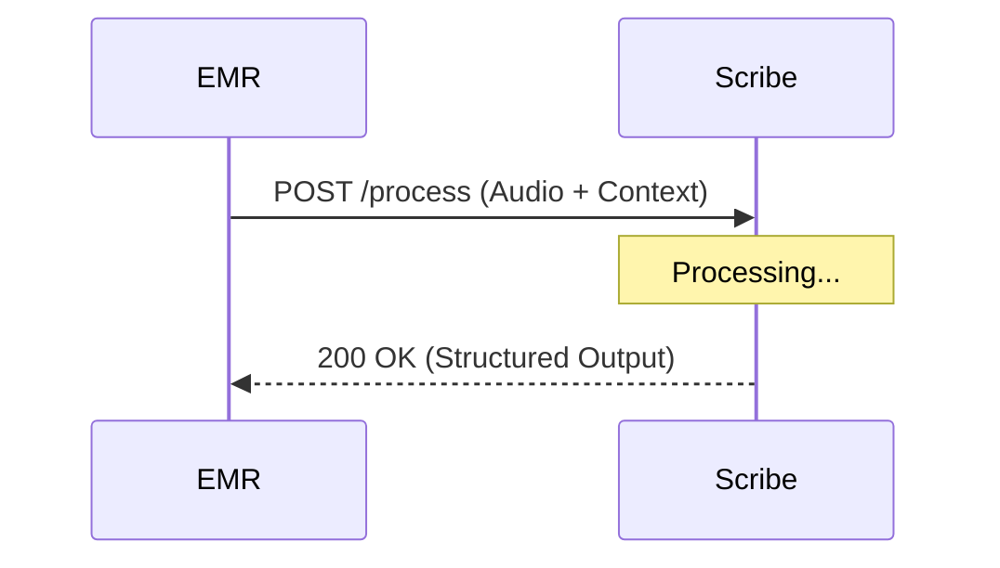
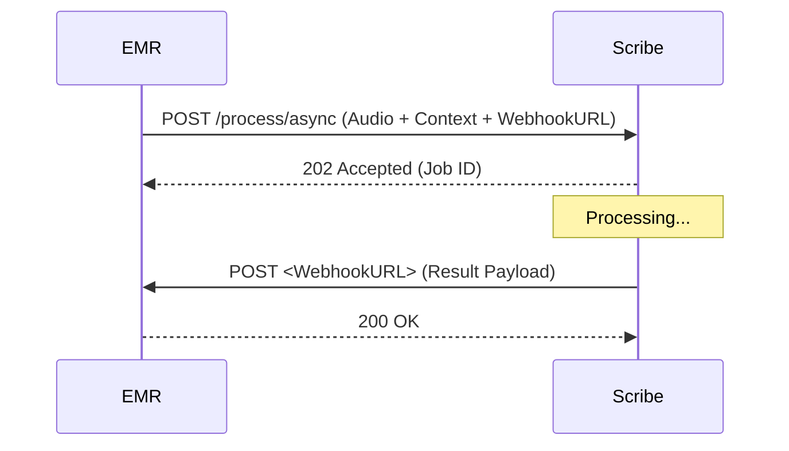
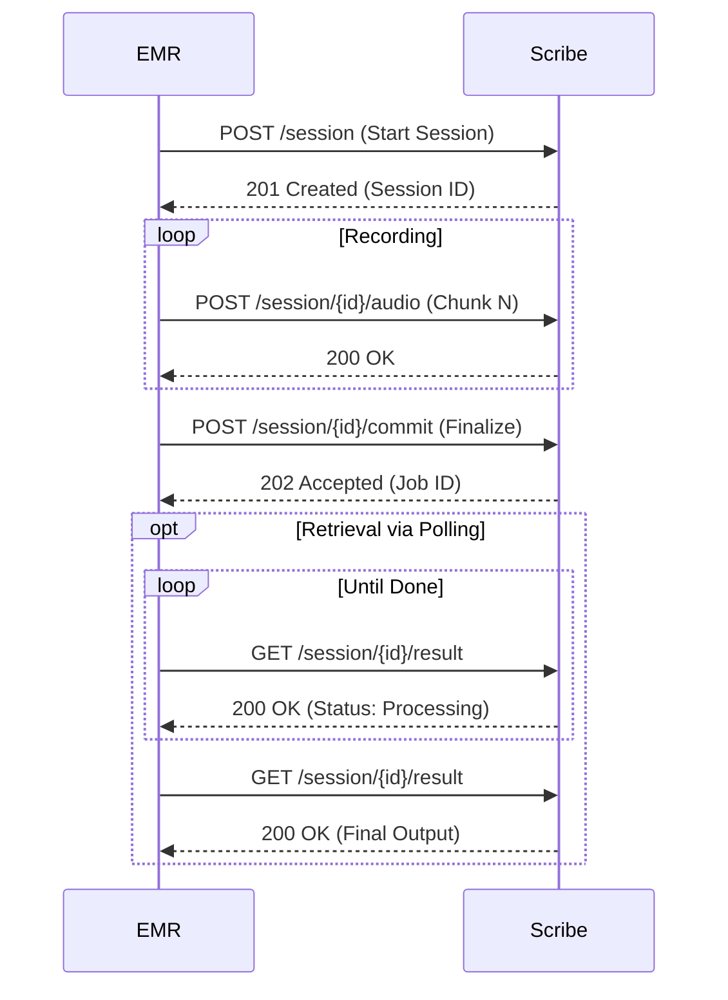

# OMSIF Architecture & Concepts

The **Open Medical Scribe Integration Framework (OMSIF)** defines a standard protocol for interoperability between Electronic Medical Record (EMR) systems and AI Scribe solutions.

## Core Concepts

### Roles
*   **EMR (Client)**: The system of record (Electronic Medical Record) that holds patient data and initiates requests for transcription.
*   **Scribe (Server)**: The AI-powered service that accepts audio/context and returns structured medical documentation (notes, FHIR resources, etc.).

### Resources
*   **Template**: A definition of the output format offered by the Scribe (e.g., "SOAP Note", "Cardiology Consult", "Psychiatric Evaluation").
*   **Session**: A stateful interaction context representing a single medical encounter being recorded.
*   **Job**: An asynchronous task handling the transcription/generation process.

## High-Level Workflows

### 1. Initialization Handshake
The interaction begins with a bidirectional handshake to exchange capabilities and versions.

### 2. Transcription Modalities

OMSIF supports three modalities to accommodate different network conditions and user workflows.

#### A. Synchronous (Short Audio)
Best for short dictations or commands where immediate feedback is required. The EMR holds the connection open until processing is complete.

#### B. Asynchronous (Long Audio / Background)
Best for full consultations. The EMR submits the job and receives a Job ID. The Scribe calls a webhook when done.

#### C. Chunked / Streaming (Real-time or Unstable Network)
Allows uploading audio in parts. Essential for long recordings or when recording is happening live.

## Security Model

*   **Transport Security**: All communication MUST happen over HTTPS (TLS 1.2+).
*   **Authentication**:
    *   Standard `Authorization` header.
    *   Supports Bearer Tokens (OAuth2) or API Keys (`Authorization: Bearer <token>`).
    *   Scribe vendors provide credentials to EMR integrators.

## Data Exchange
*   **Format**: JSON for all control messages and metadata.
*   **Audio**: Common formats (WAV, MP3, AAC, M4A).
*   **Encoding**: Base64 for small inline audio, or standard multipart/form-data for uploads.
